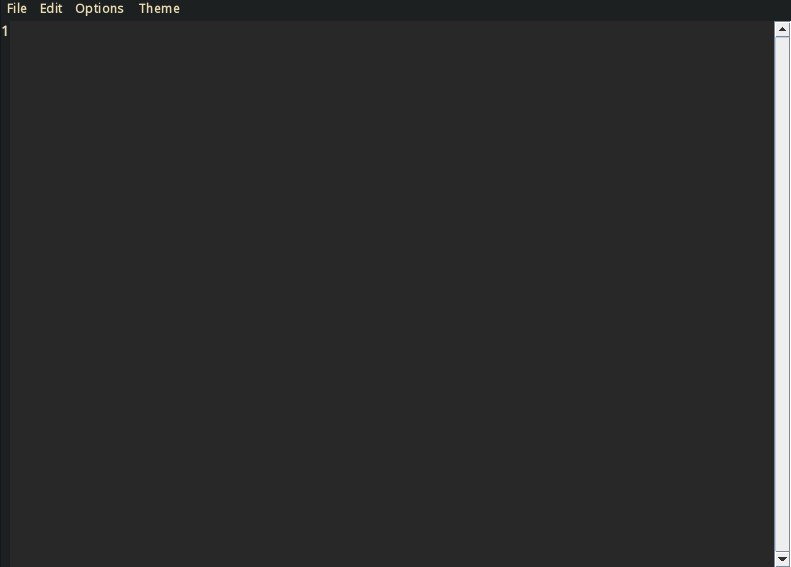
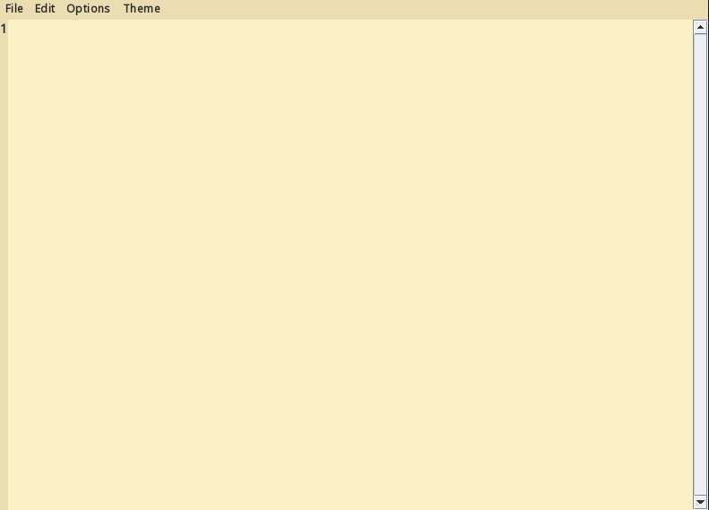

# MiniJPad

## A Text Editor Written in Java using the built-in Swing library

Free and open source Windows notepad upgrade featuring nice options for programming/scripting.

<div style="display:flex;">


</div>

This project is still in its early stages, every feature might not be implemented yet.

## Requirements

- Java 19 or above (on windows a popup will send you to download link)
- wget (for Linux cli installation)

## Installation

### Windows

Releases > MiniJPad.exe

### Linux

```bash
wget https://github.com/ken-soares/MiniJPad/releases/download/test/MiniJPad-0.0.1.tar.gz
tar -xf MiniJPad-0.0.1.tar.gz
cd MiniJPad/
chmod +x install.sh
sudo ./install.sh
```

## Development Goals

- [x] basic color themes (gruvbox)
- [x] display line number
- [ ] convert tabs to spaces button
- [ ] support for keybindings
- [ ] custom configuration file
- [ ] ~~python, lua, c, bash syntax highlighting~~ (out of scope for the time being)
